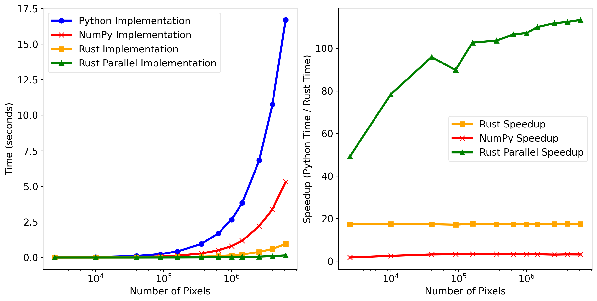

# MandelFast


This is intended as an example of a Python project using `rust` to significantly speed up a performance critical part. The project uses 
[maturin](https://github.com/PyO3/maturin) to make the compiled rust function available from Python. 

The project demonstrates this for the Mandelbrot set, but the setup is generally applicable to a wide range of cases. 

## The Mandelbrot set 

The formal definition of the Mandelbrot set is, per Wikipedia 

> The Mandelbrot set is the uncountable set of values of c in the complex plane for which the orbit of the critical point $z=0$ under iteration of the quadratic map. 
> $$
> z \rightarrow z^2 + c
> $$
> remains bounded.[28] Thus, a complex number c is a member of the Mandelbrot set if, when starting with $z_0=0$ and applying the iteration repeatedly, the absolute value of  remains bounded for all $n > 0$.

## Algorithm 

The project implements a simple iterative procedure that for each point in the 
complex-plane computes the escape time (the number of iterations before it becomes unbounded) - as pseudocode

```
FUNCTION escape_time(cx, cy, max_iter):
    x ← 0
    y ← 0
    iter ← 0

    WHILE (x² + y² ≤ 4) AND (iter < max_iter):
        x_new ← x² − y² + cx
        y ← 2·x·y + cy
        x ← x_new
        iter ← iter + 1

    RETURN iter
```

## Implementations 

The project implements three versions of the algorithm 

- A Python implementation
- A Rust implementation
- A parallel Rust implementation

## Benchmark 

The graphs below show timings and speed-up factors as a function of the number of complex-points/pixels computed.



